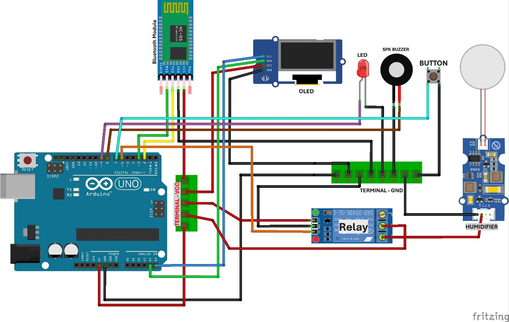

# Arduino Project Humidifier 💧💨😶‍🌫️

Kode Arduino untuk mengontrol Humidifier. Project ini dirancang untuk menciptakan suasana relaksasi dengan kombinasi uap yang dapat dikontrol melalui push button atau bluetooth.

## 📋 Fitur
- **Kontrol**: Memiliki dua cara kontrol yaitu melalui push button dan bluetooth.
- **Indikator**: Terdapat beberapa komponen output yang menjadi indikator keadaan perangkat, yaitu LCD OLED I2C, LED, Buzzer, dan Humidifiernya sendiri.

## 🛠️ Komponen yang Dibutuhkan
- **Arduino Board**
- **Ultrasonik Humidifier**
- **Relay**
- **LCD OLED I2C**
- **LED**
- **Buzzer**
- **Push Button**
- **Bluetooth HC-05**

## 👥 Anggota Kelompok
- 👩‍💻 Meitiasari Nurlatifah (2230511001)
- 👩‍💻 Dian Sela Anjelina (2230511002)
- 🧑‍💻 Farhan Adiaswara (2230511003)
- 🧑‍💻 Rafi Maulana Putra (2230511005)
- 🧑‍💻 Dani Akhmad Maulana (2230511007)
- 👩‍💻 Natya Octaviana (2230511024)
- 🧑‍💻 Irez Abdullah (2230511041)

## 💡 Skema dan wiring project Humidifier

